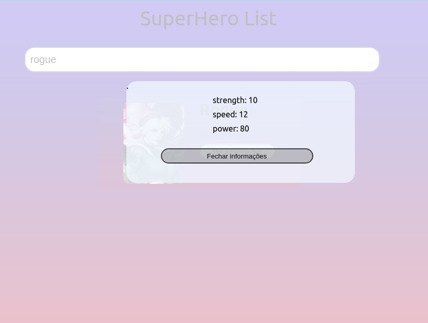
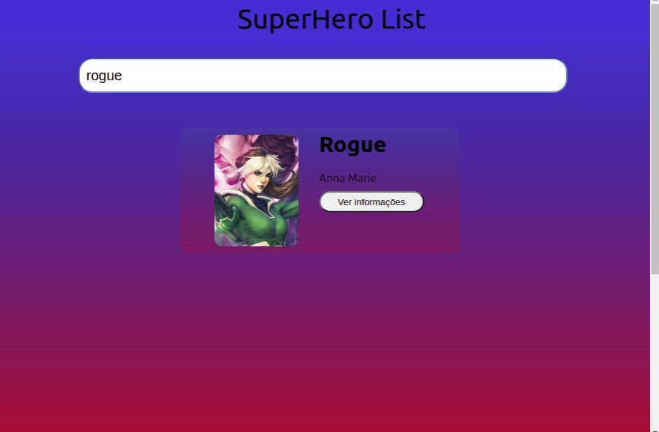

# React Super Hero List

### Aplicação de busca de super herois

*SuperHero API - https://superheroapi.com/

*create-react-app - https://pt-br.reactjs.org/docs/create-a-new-react-app.html

*Primary colors Super Heroes - https://splashpages.wordpress.com/2018/01/14/o-design-dos-super-herois-identidade-cores-e-uniformes/

*Modal - https://www.npmjs.com/package/react-modal

$ npm install --save react-modal
$ yarn add react-modal

